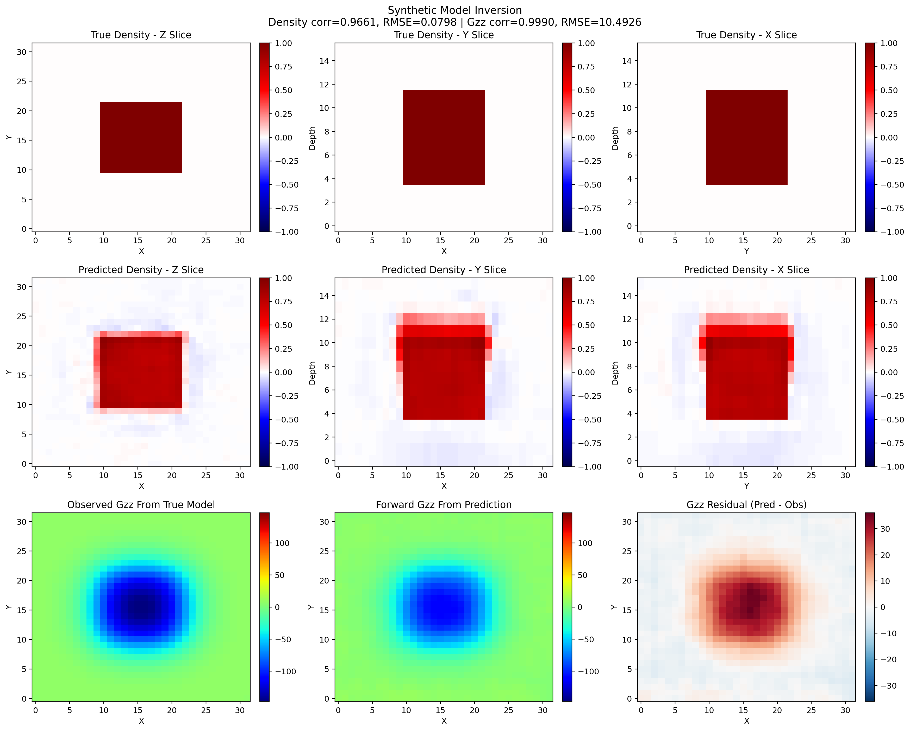
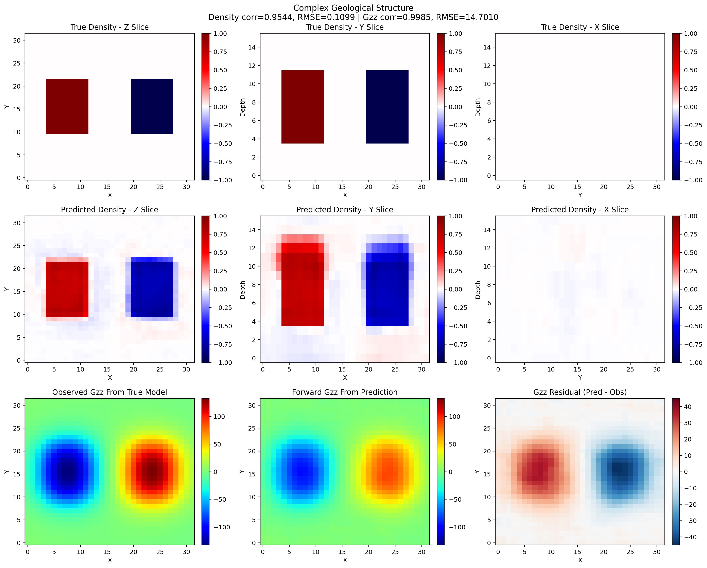
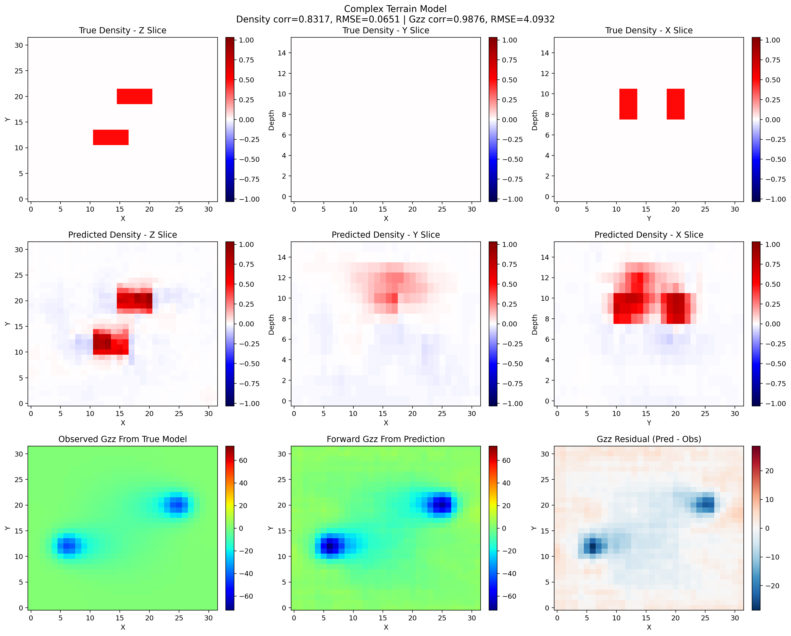
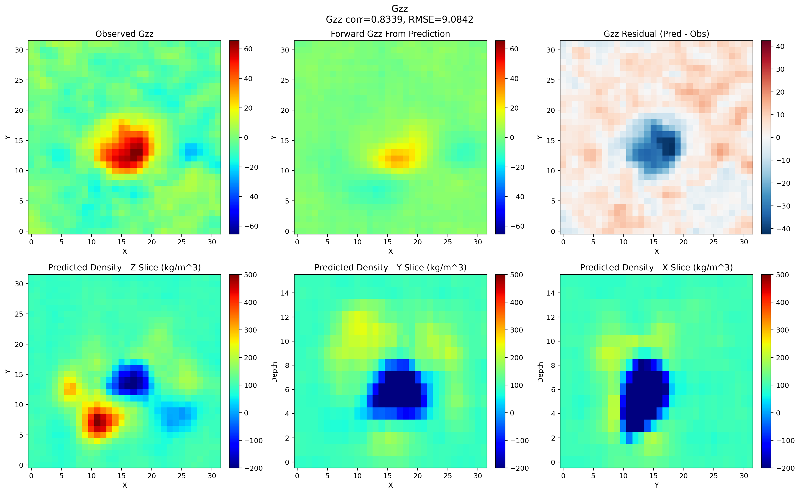

# Hybrid 2D-3D Transformer Network with Channel-to-Depth Lifting for 3D Density Gravity Inversion

## Description

This repository contains a physics-guided deep learning workflow for reconstructing 3D density contrast models from gravity observations. The implementation combines a 2D residual encoder, a channel-to-depth lifting module, a 3D Transformer bottleneck, cross-dimensional attention, and differentiable gravity forward modeling for volumetric density inversion.

The method description in this README primarily follows the manuscript draft `A Hybrid 2D-3D Transformer Network with Channel-to-Depth Lifting for 3D Density Gravity Inversion(2).docx`, while the commands, defaults, metrics, and file paths are taken directly from the tracked code and result folders in this repository.

This repository already includes:

- a pretrained checkpoint: `best_model.pth`
- three bundled synthetic `.vti` examples in `examples/`
- saved validation outputs in `folder_validation_results/`
- saved batch-style example outputs in `batch_test_results/`
- an included field benchmark grid: `Field data example/Gzz.txt`

<p align="center">
  
  
  
</p>
<p align="center"><em>Bundled synthetic comparison panels for the simple prism, complex geological structure, and complex terrain examples.</em></p>

## Repository Structure

```text
.
|-- source code/
|   |-- config.py
|   |-- data_preparation.py
|   `-- train_code.py
|-- examples/
|   |-- example one/
|   |-- example two/
|   `-- example three/
|-- Field data example/
|-- batch_test_results/
|-- folder_validation_results/
|-- folder_validation_test.py
|-- best_model.pth
|-- README.md
`-- A Hybrid 2D-3D Transformer Network with Channel-to-Depth Lifting for 3D Density Gravity Inversion(2).docx
```

## Installation

There is currently no `requirements.txt` in the tracked root, so install the main dependencies manually:

```bash
pip install torch numpy scipy matplotlib vtk
```

Notes:

- `vtk` is required for reading the bundled `.vti` models during folder-based validation.
- A CUDA-enabled PyTorch build is strongly recommended for training.
- Before training, update `save_dir` in [`source code/config.py`](source%20code/config.py), because the current default path is machine-specific.

## Requirements

- Python 3.10
- PyTorch
- NumPy
- SciPy
- Matplotlib
- VTK for `.vti` example validation

## Method Overview

### 1. Input representation

The default training mode in [`source code/config.py`](source%20code/config.py) is `joint`. In this mode, the input volume has shape `[B, 3, D, H, W]` and contains:

- channel 1: normalized `Gz`
- channel 2: normalized `Gzz`
- channel 3: normalized depth encoding from `0` to `1`

Default grid settings:

- `D = 16`
- `H = W = 32`
- `dx = dz = 100 m`

If `data_mode = "gz"`, the input becomes `[B, 2, D, H, W]` and omits the `Gzz` channel.

### 2. Hybrid 2D-3D architecture

Following the manuscript and the tracked implementation in [`source code/train_code.py`](source%20code/train_code.py), the network proceeds as follows:

1. A shared 2D encoder extracts high-level response features from the surface data.
2. The encoded 2D latent map is aggregated across the repeated depth stack.
3. `ChannelToDepthLifting` converts the compact 2D latent representation into a coarse 3D seed volume.
4. A 3D Transformer bottleneck refines the lifted volume with global spatial context.
5. `CrossDimAttention` injects high-resolution 2D information back into the 3D decoding path.
6. A 3D decoder upsamples the volume to the final density grid.
7. A 3D unsharp-mask block sharpens reconstructed boundaries.

The tensor flow described in the manuscript is consistent with the current implementation:

- input volume: `[B, 3, 16, 32, 32]`
- encoder latent map: `[B, 256, 4, 4]`
- lifted seed volume: `[B, 64, 16, 4, 4]`
- decoder output volume: `[B, 1, 16, 32, 32]`

Default architecture parameters:

| Parameter | Value |
|---|---:|
| `grid_shape` | `(16, 32, 32)` |
| `encoder_channels` | `(32, 64, 128, 256)` |
| `decoder_channels` | `(128, 64, 32)` |
| `lifting_channels` | `64` |
| `num_transformer_layers` | `4` |
| `num_heads` | `8` |
| `use_position_encoding` | `True` |
| `use_depth_attention` | `True` |

### 3. Composite loss

The manuscript foregrounds five core loss terms:

```text
L_paper =
    lambda_phys  * L_phys
  + lambda_depth * L_depth
  + lambda_focus * L_focus
  + lambda_gdl   * L_gdl
  + lambda_edge  * L_edge
```

Paper-aligned interpretations:

- `L_phys`: physics-consistency loss between observed gravity and forward gravity from the predicted density model
- `L_depth`: depth-weighted mean-squared error to improve deep anomaly recovery
- `L_focus`: focal weighted loss to emphasize anomalous regions over background
- `L_gdl`: gradient-difference loss for spatial smoothness and structural consistency
- `L_edge`: edge-enhancement loss for boundary sharpening

The current implementation in [`source code/train_code.py`](source%20code/train_code.py) keeps those five terms and adds three extra regularizers:

```text
L_code =
    w_depth    * L_depth
  + w_focus    * L_focus
  + w_gdl      * L_gdl
  + w_physics  * L_phys
  + w_edge     * L_edge
  + w_l1       * L_l1
  + w_morph    * L_morph
  + w_boundary * L_boundary
```

Implementation details:

- `L_depth` uses weights proportional to `(z + epsilon)^beta`
- `L_focus` uses `1 + focus_beta * |rho_true|`
- `L_gdl` compares 3D finite-difference gradients along `x`, `y`, and `z`
- `L_edge` uses target edge magnitudes to up-weight boundary regions
- `L_morph` applies differentiable opening and closing
- `L_boundary` explicitly sharpens normalized 3D edges
- an `AdaptiveLossBalancer` keeps loss magnitudes on comparable scales during training

Important implementation note: in the tracked training code, the differentiable physics term is currently evaluated against the `Gz` observation channel generated in the dataset pipeline, even when `joint` mode also uses `Gzz` as an input feature.

Default loss-related parameters:

| Parameter | Value |
|---|---:|
| `w_depth` | `1.0` |
| `w_focus` | `1.0` |
| `w_gdl` | `1.5` |
| `w_physics` | `0.3` |
| `w_edge` | `0.5` |
| `w_l1` | `0.05` |
| `w_morph` | `0.05` |
| `w_boundary` | `0.5` |
| `depth_beta` | `2.0` |
| `focus_beta` | `10.0` |

### 4. Synthetic data generation

Training data are generated on the fly in [`source code/data_preparation.py`](source%20code/data_preparation.py), so no pre-built training dataset is required.

The generator mixes a broad range of synthetic density models, including:

- prisms
- spheres
- trapezoids
- staircase bodies
- nested structures
- multi-scale blocky bodies
- faults
- Perlin-style terrain models
- fractal structures
- figure-eight staircase patterns
- separated prisms
- hollow boxes
- layered density models
- scattered anomalies
- more realistic mixed anomalies

The training pipeline also includes:

- curriculum learning during the first `30` epochs
- random flips
- random density scaling
- elastic deformation
- depth shifting
- geological noise injection
- `1%` to `5%` Gaussian noise on synthetic gravity responses

### 5. Training defaults

Main defaults from [`source code/config.py`](source%20code/config.py) and [`source code/train_code.py`](source%20code/train_code.py):

| Parameter | Value |
|---|---:|
| `data_mode` | `joint` |
| `lr` | `5e-4` |
| `batch_size` | `8` |
| `epochs` | `400` |
| `steps_per_epoch` | `500` |
| optimizer | `AdamW` |
| weight decay | `1e-4` |
| scheduler | `CosineAnnealingLR` |
| minimum LR | `1e-6` |
| mixed precision | enabled on CUDA |

## Usage

### 1. Set a writable checkpoint directory

Before training, edit `save_dir` in [`source code/config.py`](source%20code/config.py) and replace the current machine-specific value with a valid local path.

### 2. Train the model

From the repository root:

```bash
python "source code/train_code.py" --epochs 400 --batch_size 8 --lr 5e-4
```

### 3. Verify gradient flow for the physics loss

```bash
python "source code/train_code.py" --verify-only
```

### 4. Evaluate the bundled `.vti` examples

The tracked validation script is [`folder_validation_test.py`](folder_validation_test.py). It loads `best_model.pth`, evaluates all `.vti` models under `examples/`, and writes metrics plus saved arrays to `folder_validation_results/`.

```bash
python folder_validation_test.py \
  --checkpoint best_model.pth \
  --models-dir examples \
  --output-dir folder_validation_results \
  --device auto
```

Generated outputs include:

- `pred_density.npy`
- `true_density.npy`
- `obs_gravity.npy`
- `pred_gravity.npy`
- `metrics.json`
- `summary.csv`
- `summary.json`
- `vis_highres/*.png`

### 5. Inspect the included field-data outputs

The repository includes a field benchmark grid at [`Field data example/Gzz.txt`](Field%20data%20example/Gzz.txt) together with saved prediction artifacts in [`batch_test_results/field_data/gzz/`](batch_test_results/field_data/gzz/). The saved figures and metrics can be inspected directly even though the exact batch inference helper used to export them is not tracked in the repository root.

## Bundled Results

Synthetic example summaries can be read from [`folder_validation_results/summary.csv`](folder_validation_results/summary.csv) and [`batch_test_results/summary.csv`](batch_test_results/summary.csv).

### Synthetic validation metrics

| Example | Deep IoU | Density RMSE | Density Corr. | Gzz RMSE | Gzz Corr. |
|---|---:|---:|---:|---:|---:|
| Synthetic Model Inversion | `0.8252` | `0.0798` | `0.9661` | `10.4926` | `0.9990` |
| Complex Geological Structure | `0.7627` | `0.1099` | `0.9544` | `14.7010` | `0.9985` |
| Complex Terrain Model | `0.4635` | `0.0651` | `0.8317` | `4.0932` | `0.9876` |

`Deep IoU` is computed in the validation code on deeper layers only (`depth_threshold = 8`) with anomaly threshold `|density| > 0.3`.

### Field benchmark metrics

| Dataset | Gzz RMSE | Gzz MAE | Gzz Corr. | Predicted density range |
|---|---:|---:|---:|---:|
| Included field `Gzz` example | `9.0842` | `6.2498` | `0.8339` | `[-200, 500] kg/m^3` |

According to the manuscript draft, the included field benchmark corresponds to the Vinton salt dome example in Louisiana, USA.

## Example Gallery

All image assets currently bundled in the repository are embedded below.

### Synthetic Model Inversion

This bundled example corresponds to the simplest benchmark case: a compact positive density body with clear boundaries and a highly consistent gravity response.

Deep IoU = `0.8252`, density RMSE = `0.0798`, density corr = `0.9661`, Gzz corr = `0.9990`.

<p align="center">
  
  
</p>
<p align="center"><em>True and predicted isosurfaces.</em></p>

<p align="center">
  
  
</p>
<p align="center"><em>True and predicted voxel models.</em></p>

<p align="center">
  
  
  
</p>
<p align="center"><em>True orthogonal 2D slices along x, y, and z.</em></p>

<p align="center">
  
  
  
</p>
<p align="center"><em>Predicted orthogonal 2D slices along x, y, and z.</em></p>

<p align="center">
  
  
  
</p>
<p align="center"><em>True 3D slice renderings along x, y, and z.</em></p>

<p align="center">
  
  
  
</p>
<p align="center"><em>Predicted 3D slice renderings along x, y, and z.</em></p>

<p align="center">
  
  
</p>
<p align="center"><em>Observed and forward Gzz maps.</em></p>

<p align="center">
  
  
</p>
<p align="center"><em>Residual map and residual histogram.</em></p>

### Complex Geological Structure

This example shows a more difficult multi-body geological configuration with stronger polarity contrast and more complicated spatial interaction between anomalies.

Deep IoU = `0.7627`, density RMSE = `0.1099`, density corr = `0.9544`, Gzz corr = `0.9985`.

<p align="center">
  
  
</p>
<p align="center"><em>True and predicted isosurfaces.</em></p>

<p align="center">
  
  
</p>
<p align="center"><em>True and predicted voxel models.</em></p>

<p align="center">
  
  
  
</p>
<p align="center"><em>True orthogonal 2D slices along x, y, and z.</em></p>

<p align="center">
  
  
  
</p>
<p align="center"><em>Predicted orthogonal 2D slices along x, y, and z.</em></p>

<p align="center">
  
  
  
</p>
<p align="center"><em>True 3D slice renderings along x, y, and z.</em></p>

<p align="center">
  
  
  
</p>
<p align="center"><em>Predicted 3D slice renderings along x, y, and z.</em></p>

<p align="center">
  
  
</p>
<p align="center"><em>Observed and forward Gzz maps.</em></p>

<p align="center">
  
  
</p>
<p align="center"><em>Residual map and residual histogram.</em></p>

### Complex Terrain Model

This example emphasizes more irregular geometry and a harder structural recovery problem, making it useful for inspecting how well the network preserves shape under higher complexity.

Deep IoU = `0.4635`, density RMSE = `0.0651`, density corr = `0.8317`, Gzz corr = `0.9876`.

<p align="center">
  
  
</p>
<p align="center"><em>True and predicted isosurfaces.</em></p>

<p align="center">
  
  
</p>
<p align="center"><em>True and predicted voxel models.</em></p>

<p align="center">
  
  
  
</p>
<p align="center"><em>True orthogonal 2D slices along x, y, and z.</em></p>

<p align="center">
  
  
  
</p>
<p align="center"><em>Predicted orthogonal 2D slices along x, y, and z.</em></p>

<p align="center">
  
  
  
</p>
<p align="center"><em>True 3D slice renderings along x, y, and z.</em></p>

<p align="center">
  
  
  
</p>
<p align="center"><em>Predicted 3D slice renderings along x, y, and z.</em></p>

<p align="center">
  
  
</p>
<p align="center"><em>Observed and forward Gzz maps.</em></p>

<p align="center">
  
  
</p>
<p align="center"><em>Residual map and residual histogram.</em></p>

### Field Data Example

Saved field-data outputs for the included `Gzz` benchmark. The manuscript associates this benchmark with the Vinton salt dome case.

<p align="center">
  
  
</p>
<p align="center"><em>Saved field-data outputs: predicted density volume and Gzz fit for the included benchmark.</em></p>

### High-Resolution Validation Snapshots

These figures were exported by `HighResVisualizer` during folder-based validation.

<p align="center">
  
  
  
</p>
<p align="center"><em>High-resolution validation snapshots exported by <code>HighResVisualizer</code>.</em></p>

## Data Availability and Notes

- The bundled synthetic `.vti` models, saved figures, and validation summaries are included directly in this repository.
- The field benchmark grid [`Field data example/Gzz.txt`](Field%20data%20example/Gzz.txt) is included locally.
- The manuscript states that the airborne benchmark data were acquired by Bell Geospace in 2008 and that broader field-data usage remains subject to provider licensing.
- The tracked root does not currently include a `requirements.txt` file.
- The tracked root also does not currently include an explicit `LICENSE` file.

## Citation

If you use this repository in academic work, please cite the associated manuscript draft:

```text
Wenjin Chen, Shengwang Yu, Zhengfeng Jin, Lei Yi, and Xiao Gong.
A Hybrid 2D-3D Transformer Network with Channel-to-Depth Lifting
for 3D Density Gravity Inversion.
```

Update this section when the manuscript receives a formal journal reference or DOI.

## Acknowledgment

According to the manuscript draft, this work was supported by the National Natural Science Foundation of China, the Strategic Priority Research Program of the Chinese Academy of Sciences, Jiangxi province of key laboratory opening funding, and the Jiangxi Province Key Research and Development Program.
