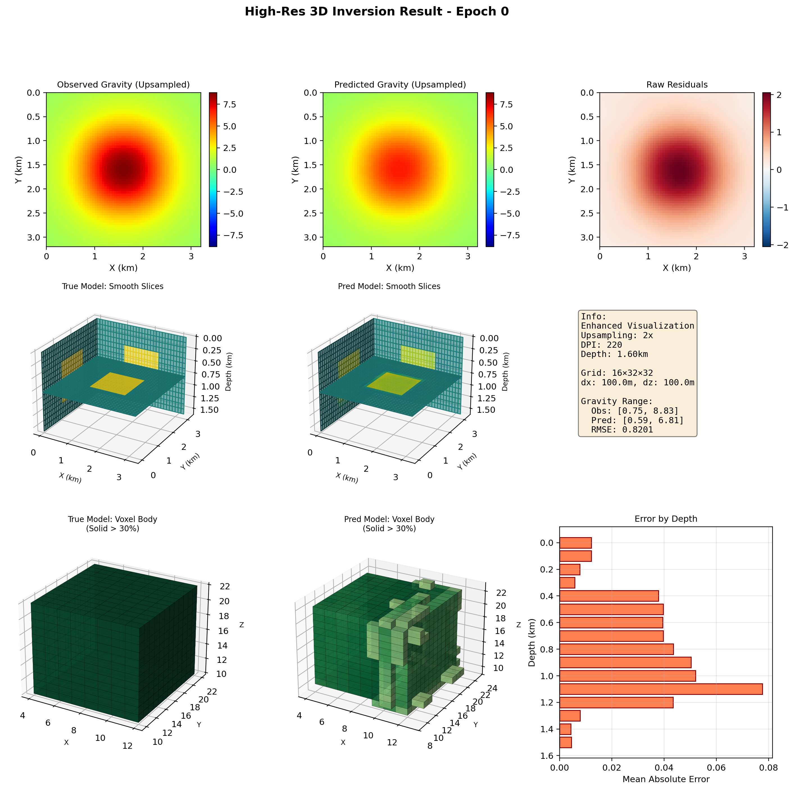
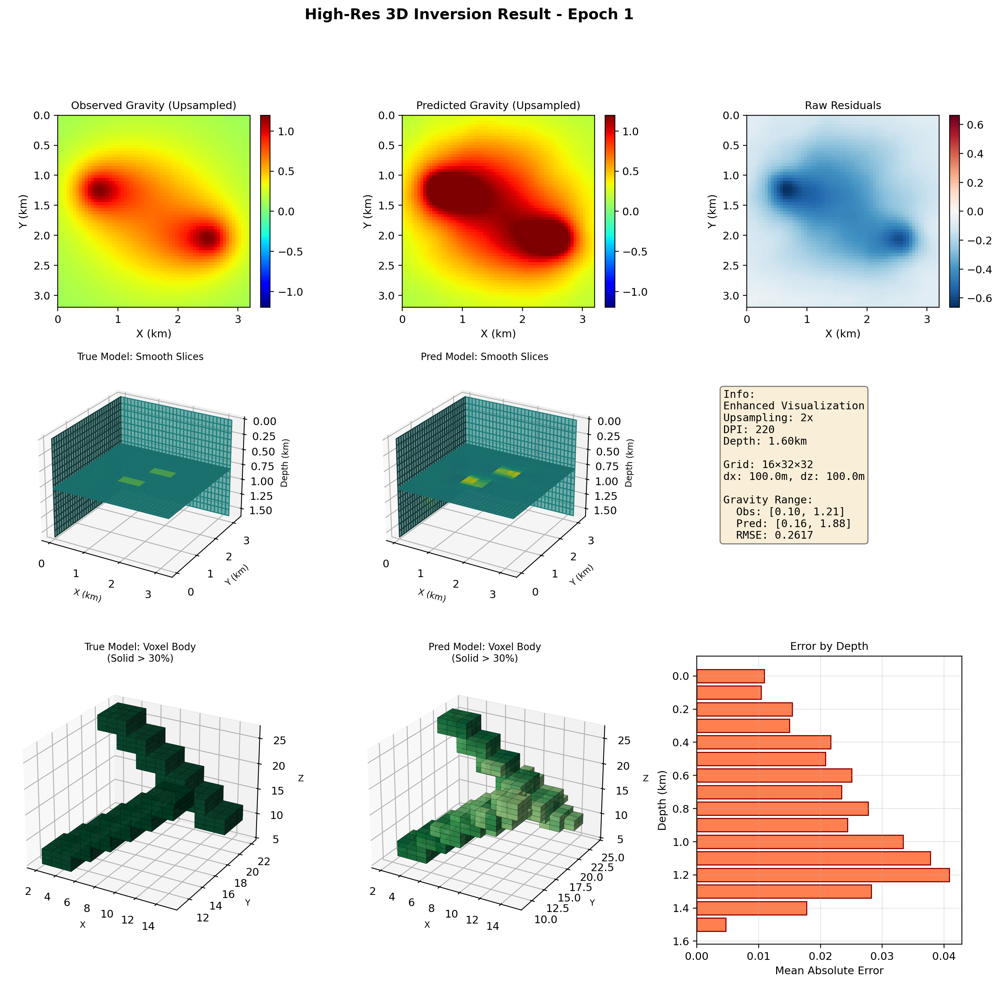
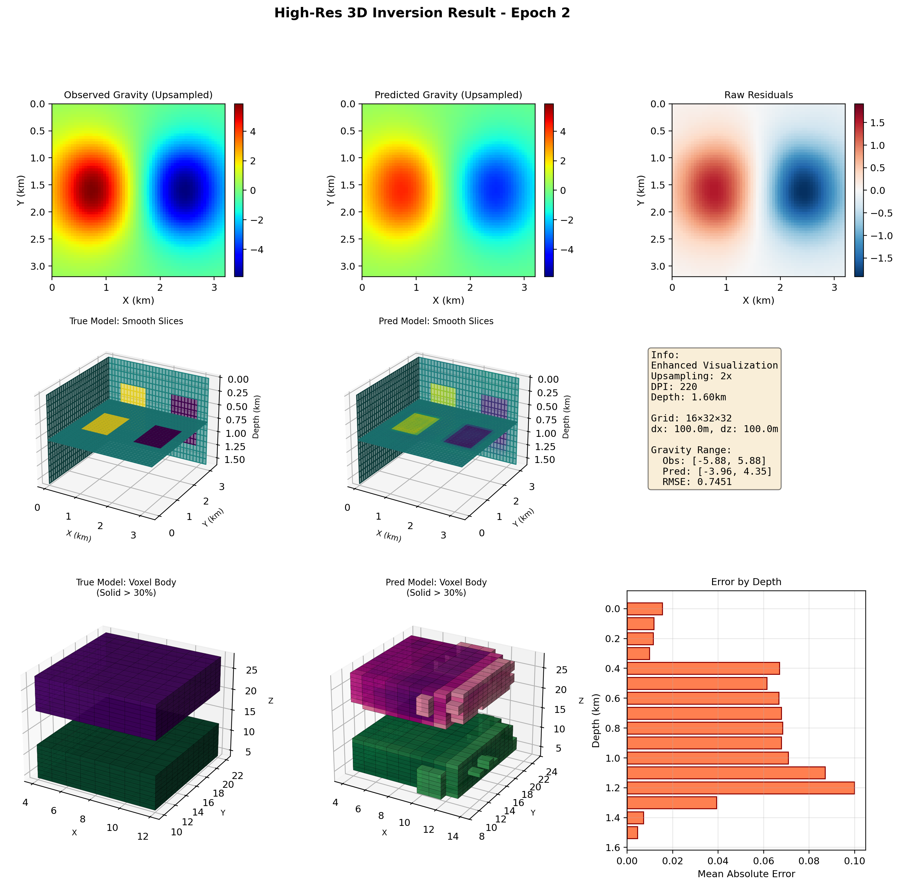

# A Hybrid 2D-3D Transformer Network with Channel-to-Depth Lifting for 3D Density Gravity Inversion
## Network Architecture

<p align="center">
  
</p>
<p align="center"><em>The architecture of the proposed deep learning convolutional neural network.</em></p>

This network is the hybrid 2D-3D Transformer proposed in the manuscript. It first extracts 2D features from surface gravity responses, then lifts the 2D features into an initial 3D volume through the Channel-to-Depth Lifting module. A 3D Transformer is subsequently used to model global spatial correlations, and cross-dimensional attention is incorporated during decoding to progressively recover the 3D density distribution. By default, the input is composed of `Gz`, `Gzz`, and normalized depth encoding, so that gravity anomalies, gravity gradients, and depth prior information can all be utilized simultaneously.

## Repository Structure

```text
.
├── source code/
│   ├── train_code.py
│   ├── config.py
│   └── data_preparation.py
├── examples/
│   ├── example one/
│   ├── example two/
│   └── example three/
├── Field data example/
│   ├── Gzz.txt
│   └── Field data example/
│       ├── 2D slice/
│       ├── 3D slice/
│       ├── 3D view of the predicted density model/
│       └── gravity/
├── test_code/
├── best_model.pth
├── test_code.py
└── README.md
```
Here, source code/ contains the core training and data-generation code corresponding to the manuscript method, examples/ and Field data example/ contain real-data examples, and  test_code.py correspond to the scripted validation , respectively. ```
## Description

This repository is the source-code release corresponding to the manuscript `A Hybrid 2D-3D Transformer Network with Channel-to-Depth Lifting for 3D Density Gravity Inversion(2).docx`. The method is designed for reconstructing three-dimensional density-contrast models from gravity anomaly (`Gz`) or vertical gravity-gradient (`Gzz`) observations.

The proposed framework is centered on the method presented in the manuscript. The model first constructs a three-channel surface-to-volume input tensor from observed gravity, observed gravity gradient, and normalized depth encoding. The default input size is `[B, 3, D, H, W]`, where the default grid size is `(D, H, W) = (16, 32, 32)`. Then, a 2D encoder extracts high-level response features from the surface observations, and the Channel-to-Depth Lifting module reorganizes these 2D features into a coarse 3D seed volume. A 3D Transformer bottleneck further models the volumetric representation, and cross-dimensional attention introduces high-resolution 2D details during the 3D decoding process.

The training objective is a composite loss consisting of physics-consistency, depth-weighted, focal, gradient-difference, and edge-enhancement terms. The code also includes several auxiliary regularizers to improve optimization stability and sharpen reconstructed boundaries. The overall goal is to improve deep sensitivity, anomaly focusing, structural smoothness, and boundary delineation, so that the geometry of subsurface anomalous bodies can be recovered more effectively.

This repository currently includes:

- the main training and model-definition code in [`source code/`](source%20code/)
- the best model checkpoint `best_model.pth` obtained from a 400-epoch training run
- three synthetic `.vti` examples and their result figures in `examples/`
- the validation script [`test_code.py`](test_code.py) for testing trained results
- the real data file `Field data example/Gzz.txt` and the corresponding inversion figures
- evaluation results stored in `test_code/`

## Installation

<code>pip install torch numpy scipy matplotlib vtk</code>

## Requirements

- torch
- numpy
- scipy
- matplotlib
- vtk

The first four packages are used for training and scripted validation. `vtk` is required for reading the bundled `.vti` models in the repository.

## Usage

The implementation is built around the network architecture described in the manuscript. The core files include the model and training workflow in [`source code/train_code.py`](source%20code/train_code.py), the configuration in [`source code/config.py`](source%20code/config.py), and the synthetic data generator in [`source code/data_preparation.py`](source%20code/data_preparation.py).

A representative set of default parameters in the current implementation is shown below:

```python
config = V4Config(
    data_mode='joint',
    grid_shape=(16, 32, 32),
    dx=100.0,
    dz=100.0,
    encoder_channels=(32, 64, 128, 256),
    decoder_channels=(128, 64, 32),
    lifting_channels=64,
    num_transformer_layers=4,
    num_heads=8,
    lr=5e-4,
    batch_size=8,
    epochs=400,
    steps_per_epoch=500,
)
```

The composite loss can be summarized as:

```text
L = lambda_phys * L_phys
  + lambda_depth * L_depth
  + lambda_focus * L_focus
  + lambda_gdl * L_gdl
  + lambda_edge * L_edge
```

The corresponding default weights in the current code are:

```python
w_depth = 1.0
w_focus = 1.0
w_gdl = 1.5
w_physics = 0.3
w_edge = 0.5
w_l1 = 0.05
w_morph = 0.05
w_boundary = 0.5
depth_beta = 2.0
focus_beta = 10.0
```

To train the network from the repository root, first modify `save_dir` in [`source code/config.py`](source%20code/config.py), and then run:

```bash
python "source code/train_code.py" --epochs 400 --batch_size 8 --lr 5e-4
```

The code also provides a physics-gradient verification mode:

```bash
python "source code/train_code.py" --verify-only
```

Both the manuscript and the code focus on three typical examples: a simple single-prism inversion case, a more complex positive-negative anomaly geological configuration, and a staircase-style terrain case with sharper structural boundaries. The corresponding figures are already bundled in the repository and can be inspected directly without retraining.

## Run Test Codes

To perform scripted validation on the bundled `.vti` examples, use [`test_code.py`](test_code.py). This script loads `best_model.pth`, performs forward modelling to construct the required network input, runs inference on all `.vti` models under `examples/`, and writes `metrics.json`, `summary.csv`, `summary.json`, NumPy arrays, and high-resolution figures to `text_code/`.

```bash
python test_code.py \
  --checkpoint best_model.pth \
  --models-dir examples \
  --output-dir test_code \
  --device auto
```

The following figures are the high-resolution validation snapshots produced by the scripted validation workflow. These images are already included in the repository for direct inspection.

<p align="center">
  
  
  
</p>
<p align="center"><em>High-resolution validation figures exported by HighResVisualizer.</em></p>

### Synthetic example one-prism model

This example corresponds to the synthetic example one-prism model in the manuscript. The goal is for the network to reconstruct a compact anomalous body whose location, extent, and boundaries are as accurate as possible.

<p align="center">
  
  
</p>
<p align="center"><em>True and predicted isosurfaces.</em></p>

<p align="center">
  
  
</p>
<p align="center"><em>True and predicted voxel models.</em></p>

<p align="center">
  
  
  
</p>
<p align="center"><em>True orthogonal slices along x, y, and z.</em></p>

<p align="center">
  
  
  
</p>
<p align="center"><em>Predicted orthogonal slices along x, y, and z.</em></p>

<p align="center">
  
  
  
</p>
<p align="center"><em>True 3D slice renderings.</em></p>

<p align="center">
  
  
  
</p>
<p align="center"><em>Predicted 3D slice renderings.</em></p>

<p align="center">
  
  
</p>
<p align="center"><em>Observed and forward-modelled Gzz maps.</em></p>

<p align="center">
  
  
</p>
<p align="center"><em>Residual map and residual histogram.</em></p>

###  Synthetic example one-two prisms model

This example corresponds to Synthetic example one-two prisms model in the manuscript. The focus is on the model's ability to recover anomaly polarity and suppress cross-talk between different anomalous bodies.

<p align="center">
  
  
</p>
<p align="center"><em>True and predicted isosurfaces.</em></p>

<p align="center">
  
  
</p>
<p align="center"><em>True and predicted voxel models.</em></p>

<p align="center">
  
  
  
</p>
<p align="center"><em>True orthogonal slices along x, y, and z.</em></p>

<p align="center">
  
  
  
</p>
<p align="center"><em>Predicted orthogonal slices along x, y, and z.</em></p>

<p align="center">
  
  
  
</p>
<p align="center"><em>True 3D slice renderings.</em></p>

<p align="center">
  
  
  
</p>
<p align="center"><em>Predicted 3D slice renderings.</em></p>

<p align="center">
  
  
</p>
<p align="center"><em>Observed and forward-modelled Gzz maps.</em></p>

<p align="center">
  
  
</p>
<p align="center"><em>Residual map and residual histogram.</em></p>

### Synthetic example one-two staircase models

This example corresponds to Synthetic example one-two staircase models in the manuscript. It is used to evaluate the model's ability to recover sharp faults, layered boundaries, and geological geometries that are closer to piecewise-constant structures.

<p align="center">
  
  
</p>
<p align="center"><em>True and predicted isosurfaces.</em></p>

<p align="center">
  
  
</p>
<p align="center"><em>True and predicted voxel models.</em></p>

<p align="center">
  
  
  
</p>
<p align="center"><em>True orthogonal slices along x, y, and z.</em></p>

<p align="center">
  
  
  
</p>
<p align="center"><em>Predicted orthogonal slices along x, y, and z.</em></p>

<p align="center">
  
  
  
</p>
<p align="center"><em>True 3D slice renderings.</em></p>

<p align="center">
  
  
  
</p>
<p align="center"><em>Predicted 3D slice renderings.</em></p>

<p align="center">
  
  
</p>
<p align="center"><em>Observed and forward-modelled Gzz maps.</em></p>

<p align="center">
  
  
</p>
<p align="center"><em>Residual map and residual histogram.</em></p>

### Field Data Example

This section presents the inversion figures of the real data included in `Field data example`. Unlike the synthetic examples above, this part is mainly used to show the predicted density volume, slice views, and the fit between observed and forward-modelled responses under the real `Gzz` input.

<p align="center">
  
  
</p>
<p align="center"><em>Isosurface and voxel views of the predicted density model.</em></p>

<p align="center">
  
  
  
</p>
<p align="center"><em>2D slices of the predicted density model along the x, y, and z directions.</em></p>

<p align="center">
  
  
  
</p>
<p align="center"><em>3D slice renderings of the predicted density model along the x, y, and z directions.</em></p>

<p align="center">
  
  
</p>
<p align="center"><em>Comparison between observed Gzz and the Gzz forward-modelled from the predicted density model.</em></p>

<p align="center">
  
  
</p>
<p align="center"><em>Residual distribution and residual histogram of the Gzz fit.</em></p>
